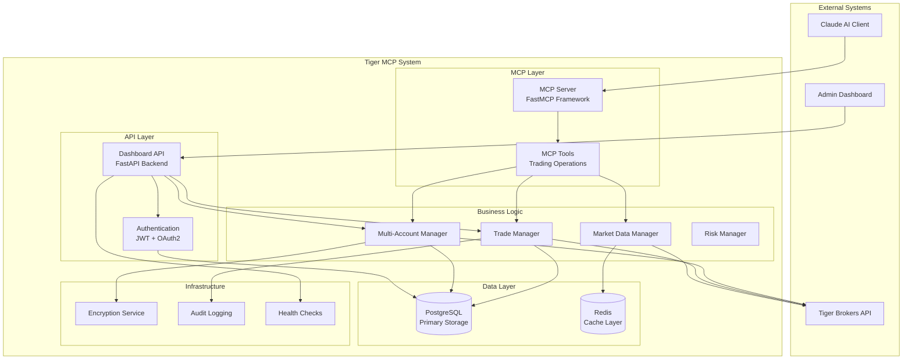
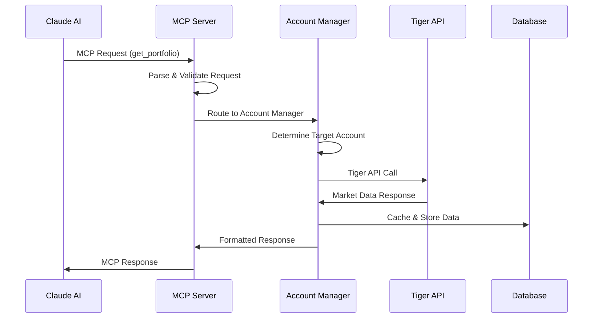
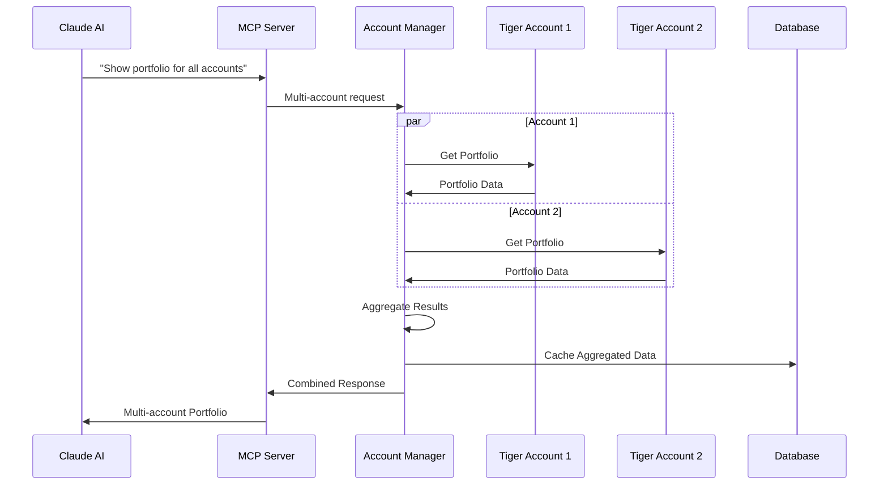
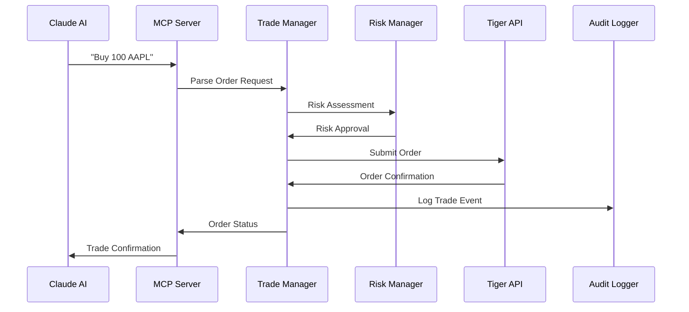
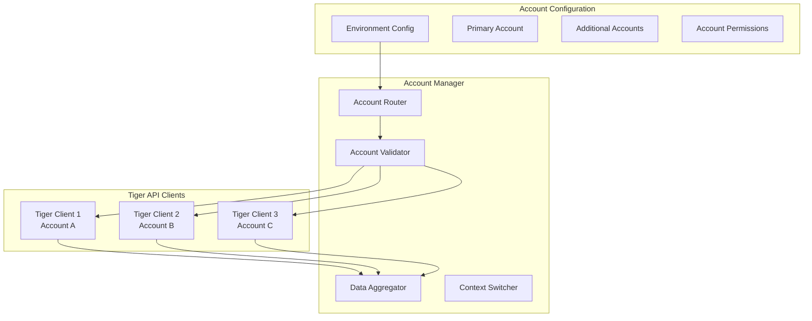
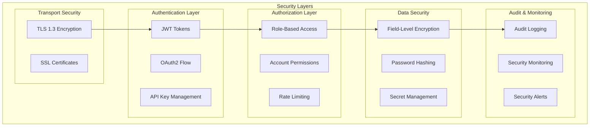
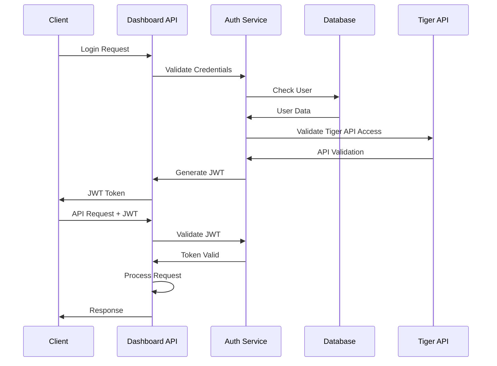
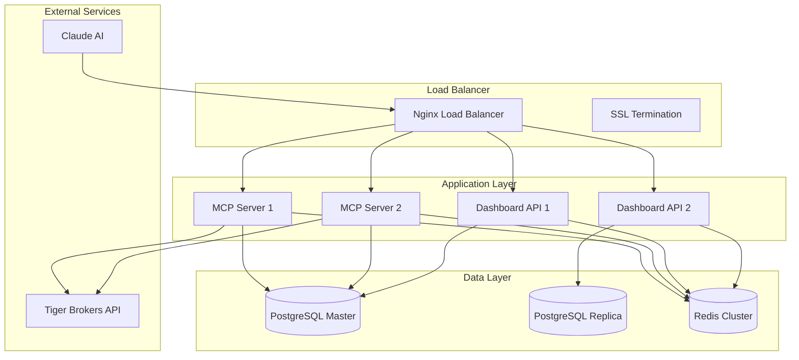
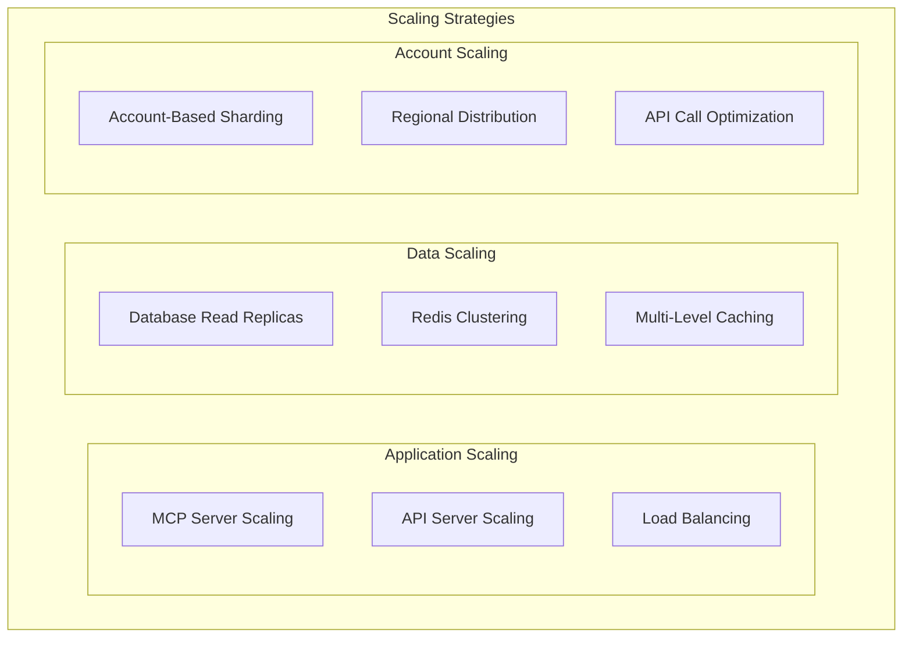

# 🏗️ System Architecture

This document provides a comprehensive overview of the Tiger MCP system architecture, component interactions, and design decisions.

## 📋 Table of Contents

- [System Overview](#-system-overview)
- [Component Architecture](#-component-architecture)
- [Data Flow](#-data-flow)
- [Multi-Account Architecture](#-multi-account-architecture)
- [Security Architecture](#-security-architecture)
- [Deployment Architecture](#-deployment-architecture)
- [Scalability Considerations](#-scalability-considerations)

## 🎯 System Overview

Tiger MCP is a **professional-grade Model Context Protocol (MCP) server** that bridges the gap between Claude AI and Tiger Brokers trading platform. The system is designed with modern async/await patterns, enterprise security, and multi-account support.

### Core Design Principles

1. **Modularity**: Clear separation of concerns across packages
2. **Scalability**: Async/await patterns for high-throughput operations
3. **Security**: Multi-layer security with encrypted credentials and audit logging
4. **Reliability**: Comprehensive error handling and graceful degradation
5. **Maintainability**: Clean code architecture with type hints and documentation

## 🧩 Component Architecture



### Package Architecture

```
packages/
├── mcp-server/          # MCP Protocol Implementation
│   ├── tools/          # MCP tool implementations
│   ├── handlers/       # Request handlers
│   └── server.py       # FastMCP server
├── dashboard-api/      # REST API Backend
│   ├── routers/        # FastAPI routers
│   ├── middleware/     # Authentication & CORS
│   └── main.py         # FastAPI application
├── database/           # Data Persistence Layer
│   ├── models/         # SQLAlchemy models
│   ├── migrations/     # Alembic migrations
│   └── connection.py   # Database connection
└── shared/             # Shared Components
    ├── tiger_client.py # Tiger API client
    ├── encryption.py   # Encryption services
    ├── auth.py         # Authentication
    └── utils.py        # Common utilities
```

## 🔄 Data Flow

### 1. MCP Request Flow



### 2. Multi-Account Request Flow



### 3. Trading Order Flow



## 🏢 Multi-Account Architecture

### Account Management System

The Tiger MCP system supports **multiple Tiger Brokers accounts** through a sophisticated account routing and management system.



### Account Configuration Schema

```yaml
# Primary account (default routing)
primary_account:
  account_id: "primary_account_id"
  client_id: "primary_client_id"
  private_key: "primary_private_key"
  permissions: ["read", "trade"]

# Additional accounts
additional_accounts:
  - account_id: "account_2_id"
    client_id: "account_2_client_id"
    private_key: "account_2_private_key"
    permissions: ["read", "trade"]
  
  - account_id: "account_3_id"
    client_id: "account_3_client_id"
    private_key: "account_3_private_key"
    permissions: ["read"]  # Read-only account

# Global settings
settings:
  default_account: "primary_account_id"
  trading_accounts: ["primary_account_id", "account_2_id"]
  max_accounts: 10
  account_validation: true
```

### Account Routing Logic

```python
class AccountRouter:
    def route_request(self, request: MCPRequest) -> str:
        """Route request to appropriate account."""
        # 1. Check for explicit account specification
        if account_id := request.params.get('account_id'):
            return self.validate_account(account_id)
        
        # 2. Use context-based routing
        if context_account := self.get_context_account():
            return context_account
        
        # 3. Fall back to default account
        return self.config.default_account
    
    def aggregate_accounts(self, operation: str) -> Dict[str, Any]:
        """Aggregate data across multiple accounts."""
        results = {}
        for account_id in self.get_accessible_accounts():
            try:
                client = self.get_tiger_client(account_id)
                data = getattr(client, operation)()
                results[account_id] = data
            except Exception as e:
                results[account_id] = {"error": str(e)}
        return results
```

## 🛡️ Security Architecture

### Multi-Layer Security Model



### Credential Management

```python
class SecureCredentialManager:
    """Secure credential storage and management."""
    
    def __init__(self):
        self.encryption_key = os.getenv('ENCRYPTION_KEY')
        self.fernet = Fernet(self.encryption_key)
    
    def store_credentials(self, account_id: str, credentials: Dict):
        """Store encrypted credentials."""
        encrypted_data = self.fernet.encrypt(
            json.dumps(credentials).encode()
        )
        return self.db.store_encrypted_credentials(
            account_id, encrypted_data
        )
    
    def get_credentials(self, account_id: str) -> Dict:
        """Retrieve and decrypt credentials."""
        encrypted_data = self.db.get_encrypted_credentials(account_id)
        decrypted_data = self.fernet.decrypt(encrypted_data)
        return json.loads(decrypted_data.decode())
```

### Authentication Flow



## 🚀 Deployment Architecture

### Container Architecture



### Docker Compose Structure

```yaml
version: '3.8'
services:
  nginx:
    image: nginx:alpine
    ports: ["80:80", "443:443"]
    depends_on: [mcp-server, dashboard-api]
  
  mcp-server:
    build: ./docker/mcp-server
    environment:
      - DATABASE_URL=${DATABASE_URL}
      - REDIS_URL=${REDIS_URL}
    depends_on: [postgres, redis]
    scale: 2
  
  dashboard-api:
    build: ./docker/dashboard-api
    environment:
      - DATABASE_URL=${DATABASE_URL}
      - REDIS_URL=${REDIS_URL}
    depends_on: [postgres, redis]
    scale: 2
  
  postgres:
    image: postgres:15-alpine
    environment:
      - POSTGRES_DB=${DB_NAME}
      - POSTGRES_USER=${DB_USER}
      - POSTGRES_PASSWORD=${DB_PASSWORD}
    volumes:
      - postgres_data:/var/lib/postgresql/data
  
  redis:
    image: redis:7-alpine
    command: redis-server --appendonly yes
    volumes:
      - redis_data:/data
```

## 📈 Scalability Considerations

### Horizontal Scaling



### Performance Optimization

1. **Connection Pooling**: Async connection pools for database and external APIs
2. **Caching Strategy**: Multi-level caching with Redis and in-memory caches
3. **Batch Processing**: Bulk operations for account aggregation
4. **Rate Limiting**: Smart rate limiting to respect Tiger API limits
5. **Circuit Breakers**: Fault tolerance for external service failures

### Multi-Account Scalability

```python
class ScalableAccountManager:
    """Scalable multi-account management."""
    
    def __init__(self):
        self.account_pool = AccountConnectionPool()
        self.cache = RedisCache()
        self.rate_limiter = RateLimiter()
    
    async def parallel_account_operation(
        self, operation: str, accounts: List[str]
    ) -> Dict[str, Any]:
        """Execute operation across accounts in parallel."""
        semaphore = asyncio.Semaphore(10)  # Limit concurrent operations
        
        async def execute_for_account(account_id: str):
            async with semaphore:
                await self.rate_limiter.wait(account_id)
                client = await self.account_pool.get_client(account_id)
                return await getattr(client, operation)()
        
        tasks = [
            execute_for_account(account_id) 
            for account_id in accounts
        ]
        results = await asyncio.gather(*tasks, return_exceptions=True)
        
        return {
            account_id: result 
            for account_id, result in zip(accounts, results)
        }
```

## 🔍 Monitoring & Observability

### Health Check Architecture

```python
class HealthCheckManager:
    """Comprehensive health monitoring."""
    
    async def get_system_health(self) -> Dict[str, Any]:
        return {
            "database": await self.check_database(),
            "redis": await self.check_redis(),
            "tiger_api": await self.check_tiger_api(),
            "accounts": await self.check_accounts(),
            "memory": self.get_memory_usage(),
            "cpu": self.get_cpu_usage(),
            "disk": self.get_disk_usage(),
        }
    
    async def check_accounts(self) -> Dict[str, str]:
        """Check health of all configured accounts."""
        results = {}
        for account_id in self.account_manager.get_accounts():
            try:
                client = self.account_manager.get_client(account_id)
                await client.get_account_info()
                results[account_id] = "healthy"
            except Exception as e:
                results[account_id] = f"unhealthy: {str(e)}"
        return results
```

### Metrics Collection

- **Application Metrics**: Request rates, response times, error rates
- **Business Metrics**: Trade volumes, account balances, P&L tracking
- **System Metrics**: CPU, memory, disk, network usage
- **Security Metrics**: Failed login attempts, API rate limiting events

This architecture provides a robust, scalable, and secure foundation for the Tiger MCP system, supporting multiple accounts while maintaining high performance and reliability.